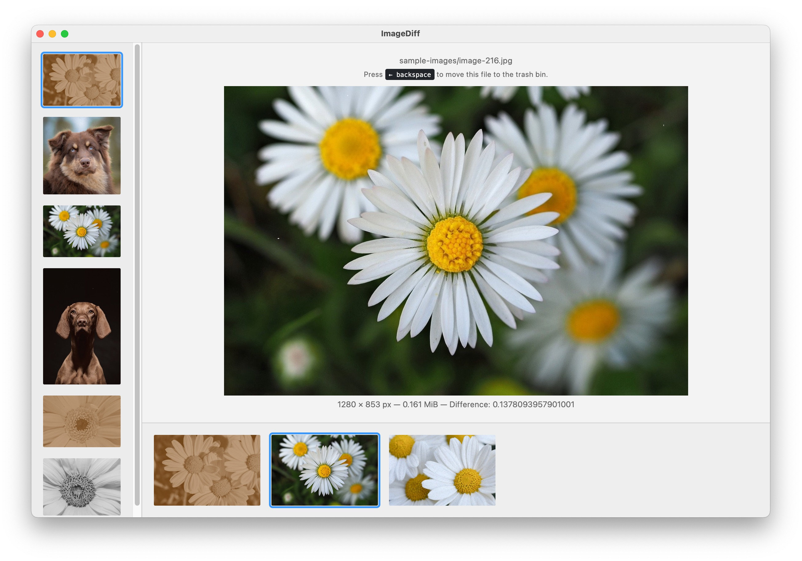

# image-diff

Python script and web UI for comparing and deleting similar or duplicate images in a folder.



## Requirements

Requires [Python](https://www.python.org/) 3.12 and [Poetry](https://python-poetry.org/) and [Node](https://nodejs.org/) 20.

Install dependencies:

```
poetry install
npm install
```

## Usage

1. Hash images (create file `hashes.json`):

    ```
    poetry run python image_hash.py <FOLDER> [<ALGORITHM>]
    ```

    Possible algorithms:
    * `PerceptualHash` (default): fast, simple, good for near-duplicate images
    * `PerceptualHashDeduplication`: fast, simple (alternative to `PerceptualHash`)
    * `NeuralHash`: slower, more advanced

2. Make `clusters.json` file, run (threshold = `10`):

    ````
    poetry run python image_cluster.py 10
    ````

3. Start UI to visualize similar image clusters from `clusters.json` file:

    ````
    npm start
    ````

## Example

The following code demonstrates a simple example:

```bash
# Download example image dataset
poetry run python download_samples.py

# Hash images
poetry run python image_hash.py sample-images NeuralHash

# Detect similar images
poetry run python image_cluster.py 0.18

# Start UI
npm start
```

## License

MIT
